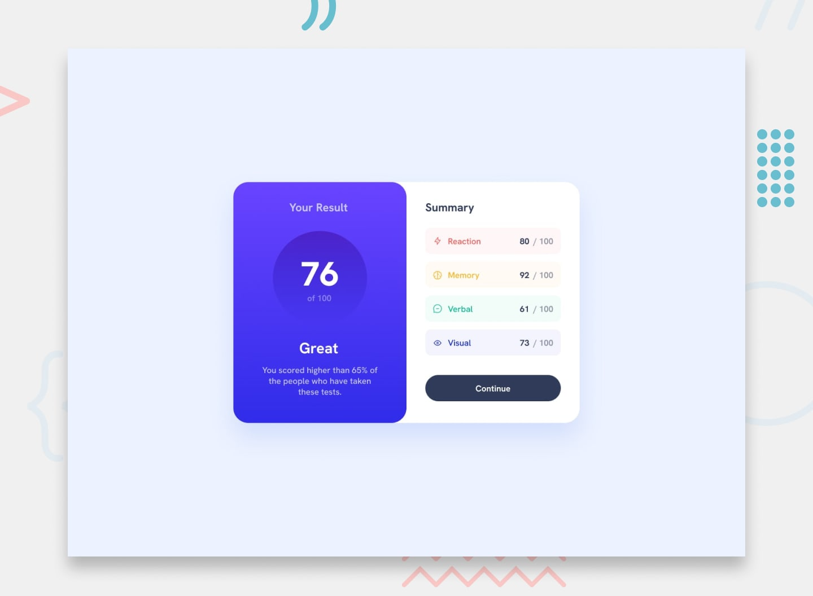

# Frontend Mentor - Results summary component solution

This is a solution to the [Results summary component challenge on Frontend Mentor](https://www.frontendmentor.io/challenges/results-summary-component-CE_K6s0maV). Frontend Mentor challenges help you improve your coding skills by building realistic projects.

## Table of contents

- [Overview](#overview)
  - [The challenge](#the-challenge)
  - [Screenshot](#screenshot)
  - [Links](#links)
- [My process](#my-process)
  - [Built with](#built-with)
  - [What I learned](#what-i-learned)
  - [Continued development](#continued-development)
- [Author](#author)

## Overview

### The challenge

Users should be able to:

- View the optimal layout for the interface depending on their device's screen size
- See hover and focus states for all interactive elements on the page
- **Bonus**: Use the local JSON data to dynamically populate the content

### Screenshot

### Links

- Solution URL: [Add solution URL here](https://github.com/mohamedrashwann/Results-summary-component)
- Live Site URL: [Add live site URL here](https://mohamedrashwann.github.io/Results-summary-component/)

## My process

### Built with

- Semantic HTML5 markup
- CSS custom properties
- Flexbox
- Mobile-first workflow
- Vanilla JavaScript for data fetching and rendering
- Local JSON data (`assets/data.json`)

### What I learned

During the process of reviewing and organizing the repository, I learned the importance of maintaining a clear and standard file structure. Specifically, I performed the following refactoring steps:

1.  **File Organization**: Moved all icon files (`icon-*.svg` and `favicon-32x32.png`) into a dedicated `assets/images/` directory.
2.  **Data Organization**: Moved the data file (`data.json`) into the `assets/` directory.
3.  **Font Organization**: Moved the font file (`HankenGrotesk-VariableFont_wght.ttf`) into the existing `static/` directory.
4.  **Path Updates**: Updated file paths in `index.html` and `script.js` to reflect the new structure. I also corrected the icon paths within the `assets/data.json` file to be relative to the `script.js` file's context.

This process reinforced the best practice of separating assets (images, data) and static resources (fonts) from the core code files (`index.html`, `style.css`, `script.js`).

### Continued development

I plan to continue focusing on:

-   **Accessibility**: Ensuring all interactive elements and content meet WCAG standards.
-   **Performance Optimization**: Further optimizing image sizes and ensuring efficient loading of assets.
-   **Automated Testing**: Implementing unit tests for the JavaScript logic to ensure data fetching and rendering are robust.

## Author

-   Frontend Mentor - [@mohamedrashwann](https://www.frontendmentor.io/profile/mohamedrashwann)
-   GitHub - [@mohamedrashwann](https://github.com/mohamedrashwann)

***

*تم إنشاء هذا الملف بواسطة Manus AI بناءً على طلب المستخدم.*
